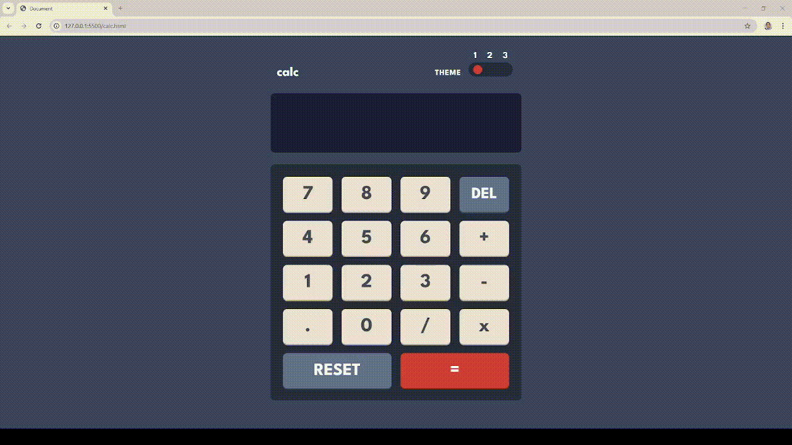

# Themed-Calculator-with-Sound-Effects

A simple yet stylish calculator built using vanilla JavaScript, HTML, and CSS. This project includes interactive features like button sounds and theme switching to enhance the user experience.

---

## ✨ Features
- Basic arithmetic operations: addition, subtraction, multiplication, and division
- Three switchable visual themes (e.g., light, dark, and modern)
- Button press sounds for tactile feedback
- Responsive design suitable for mobile and desktop screens
- Clean and modular codebase with well-structured HTML, CSS, and JS

---

## 📷 Project Preview

  

---

## 🛠️ Technologies Used
- HTML5 for structure
- CSS3 for styling and themes
- JavaScript for logic and interactivity
- Audio elements for sound integration

---
## 🚀 How to Use
- Clone or download the repository
- Open calc.html in your browser
- Use the calculator as you would normally—click buttons
- Try switching themes and enjoy the sound effects!
